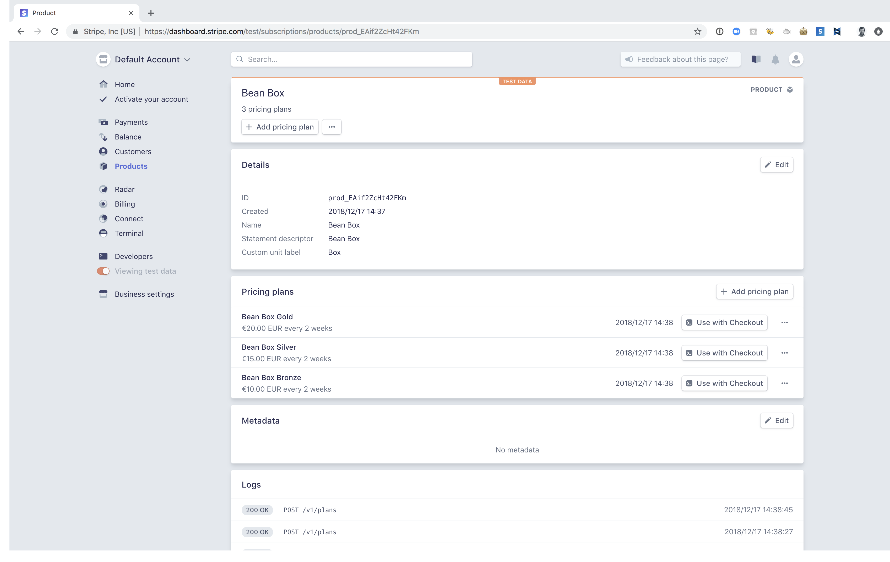
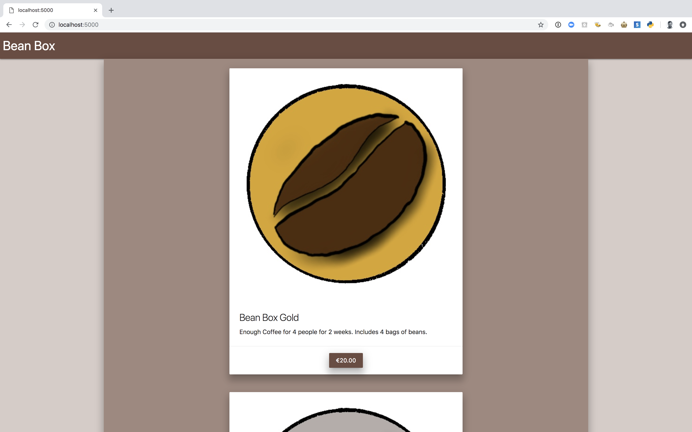

# Stripe Payments Demo

This demo shows support for payments using Stripe Checkout running on a Website powered by the Flask Micro-framework for Python. 

## Target Audience
This demo is targeted towards a developer who wants to focus on building their website without spending a lot of time on building a checkout flow. For more advanced users see [Stripe Elements](https://stripe.com/docs/stripe-js/elements/quickstart) 

## Why Stripe Checkout?

Stripe Checkout is a fully hosted checkout experience. It allows you to outsource the complexity of designing a first-class payments experience to us.

Stipe Checkout will localize the checkout experience and show relevant payment methods such as Credit Card, Apple Pay and Google Pay. By using Stripes Hosted checkout
you can integrate once and remain compliant, secure and up to date as regulations change and new payment methods become available. 

## Prerequisites
 - A Stripe Account
 - Set your Stripe Secret Key to an Environment variable *STRIPE_KEY*
 - Clone this repo
 - Use [pipenv](https://pipenv.readthedocs.io/en/latest/) to install all package dependencies
 
    `pipenv install`
    
 - Replace the existing Stripe Public Key with your Stripe Public Key in _./static/app.js_
 
## Add Checkout to your Stripe account
To get started with Checkout navigate to the _Business Settings_ menu and select _Checkout_

At the time of publishing this Checkout is in Public Beta. You can read more about what is available via the _Read Documentation_ button

Click "Enable Checkout"

Checkout is now enabled for your account. As your account is new it is in test mode. You can ignore adding a Domain for now.

## Add Products to your Stripe account
You can add Products and Plans to your account via the Dashboard or via the API. Included in this Demo is a file _seed.py_ which demos programmatically adding some 
products and plans to your account.

`python seed.py`

You should be able to see the Products you have added to your account
 


## Running the app

<strong>Make sure you have updated the Stripe Public Key in _static/app.js_</strong>

As mentioned above this demo uses Flask as the backend for this web app. In order to start the web app you simply do

```
FLASK_APP=app.py
flask run
```

And now navigate to [localhost:5000](http://localhost:5000)



By selecting one of the plans avialable and clicking the button, client side JS will extract the _plan_id_, added by Flask 
and the Jinja template and pass that through as the plan to a redirect to Stripe Checkout. 


Note the _data-plan_ attribute on the _"buy_gold"_ button
```HTML
<div class="row">
    <div class="col s0 m2 l3 xl3"></div>
    <div class="col s12 m8 l6 xl6">
        <div class="card z-depth-4">
            <div class="card-image">
              
            </div>
            <div class="card-content">
                <span class="card-title">Bean Box Gold</span>
                <p>Enough Coffee for 4 people for 2 weeks. Includes 4 bags of beans.</p>
            </div>
            <div class="center-align">
                <div class="card-action">
                    <a id="buy_gold" data-plan="plan_EAig31mTIkPcYW" class="waves-effect waves-light btn brown darken-1 z-depth-4" onclick="handleClick(this)">€20.00</a>
                </div>
            </div>
        </div>
    </div>
    <div class="col s0 m2 l3 xl3"></div>
</div>
```

_handleClick_ js function in _static/app.js_

```js
var stripe = Stripe(${YOUR_STRIPE_PUBLIC_KEY}, {
  betas: ['checkout_beta_4']
});

function handleClick(button) {
  // Generic eventListener for calling Stripe checkout
  stripe.redirectToCheckout({
    items: [{plan: button.dataset.plan, quantity: 1}],

    // Note that it is not guaranteed your customers will be redirected to this
    // URL *100%* of the time, it's possible that they could e.g. close the
    // tab between form submission and the redirect.
    successUrl: `https://${window.location.hostname}/success`,
    cancelUrl: `https://${window.location.hostname}`,
    })
    .then(function (result) {
      if (result.error) {
        // If `redirectToCheckout` fails due to a browser or network
        // error, display the localized error message to your customer.
      var displayError = document.getElementById('error-message');
        displayError.textContent = result.error.message;
      }
    });
};
```

## :star2: Bonus content! :star2:

The Flask App in this demo is incredibly simple and really could be turned into Static content.

Enter [Frozen Flask](https://pythonhosted.org/Frozen-Flask/).

Frozen Flask will generate a static site into a _build_ folder that can then be hosted on a traditional web server.

or github pages...

http://mikeshaw-stripe.github.io

To run it 

```python
python freezer.py
```